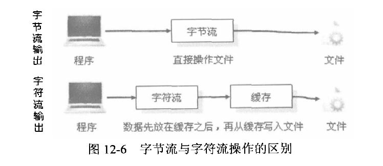

# *Java IO* #
***

*Java IO* 操主要是指对Java进行输入输出操作，*Java* 中所有的操作类都存放在 ***java.io*** 包中，在使用是需要导入此包。

在整个 ***java.io*** 包中最重要的就是5个类和1个接口，5个类是指 ***File,OutputStream,InputStream,Writer,Reader*** ；一个接口是指 ***Serializable*** 。
   
   
>区块引用测试   

	import java.io.File;
	import java.io.IOException;
	
	/**
	 * Created by jinweih on 2018/8/22.
	 * Windows中使用反斜杠 “\” 来标识路径
	 * Linux中使用斜杠 “/”来标识路径
	 * 既然java程序本身具有可移植性的特点，在编写路径的时候最好根据程序所在的操作系统自动使用符合本地操作系统要求的分隔符，这样才能达到可移植性的目的。
	 * 要实现这样的功能，则需要观察File类中提供的两个变量。
	 */
	public class FileDemo {
	    public static void main(String args[]) {
	        File dir = new File("d:" + File.separator + "javen" + File.separator + "javen2");
	        String path = dir + File.separator + "FileDemo.txt";
	        dir.mkdirs();
	        File file = new File(path);
	        if (file.exists()) {//删除文件之前判断文件是否存在
	            file.delete();//删除文件
	            System.out.println("删除文件！！！");
	        } else {
	            try {
	                file.createNewFile();//创建文件
	                System.out.println("创建文件！！！");
	            } catch (IOException e) {
	                e.printStackTrace();
	            }
	        }
	        //FileDemo2();
	        FileDemo3();
	    }
	
	    public static void FileDemo2() {
	        /**
	         * 调用静态常量
	         */
	        System.out.println("PathSeparator" + File.pathSeparator);//表示路径分隔符
	        System.out.println("Separator" + File.separator);//表示路径分隔符
	    }
	
	    public static void FileDemo3() {
	        /**
	         * 列出指定目录的全部文件
	         */
	        File file = new File("D:" + File.separator);
	        for (File fil : file.listFiles()){
	            System.out.println("列出文件目录 -- >> " + fil);
	        }
	    }
	
	    /**
	     * 判断是否为目录
	     * isDirectory
	     */
	}
	/**
	 * 在程序的开发中，往往会使用Windows开发环境，因为在Windows操作系统中支持的开发工具较多，
	 * 使用方便，而在程序发布时往往是直接在Linux或者其它操作系统上部署，所以这时如果不使用
	 * File.separstor，则程序在运行就会存在问题。
	 * 在程序每次执行完毕之后，并不会立即创建或者删除，会有一些延迟，这是因为
	 * 所有的操作都是需要JVM完成的。
	 *
	 * 程序 --- >> JVM --- >> 系统文件
	 */
	

   
### *字节流和字符流的区别*
* 字节流在操作时候本身不会用到缓冲区，是文件本身直接操作的
* 字符流在操作时使用了缓冲区。通过缓冲再操作文件
