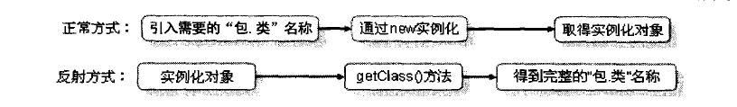

## *Java反射机制*

在java中较为重要的就是反射机制，在反射操作的中，一切的操作都将使用 ***Object*** 完成，类、数组、的引用都可以使用Object进行接收。

#### *一、class类*
任何一个类如果没有明确地声明继承自哪个父类，则 ***默认继承Object类*** ，所以 ***getClass()*** 方法是Object类中的，此方法的定义如下：

	public final Class getClass()

以上方法的返回值是一个Class类，实际上此类是Java反射的源头。所谓反射从程序运行的角度来看，即可以通过对象反射求出类的名称。

### *二、Class类的使用*

* *通过无参构造实例化对象*
* *通过有参构造实例化对象*
		
		package com.jinwei.ref;
		
		import java.lang.reflect.Constructor;
		import java.lang.reflect.Method;
		import java.lang.reflect.Modifier;
		
		/**
		 * Created by Javen on 2018/9/9.
		 */
		
		/**
		 * 反射的应用，取得类的结构
		 * 通过反射得到类的一个完整结构，就要使用到java.lang.reflect
		 * Construct   标识类中的构造方法
		 * Filed  标识类中的属性
		 * Method  标识类中的方法
		 */
		public class GetInterfaceDemo {
		    public static void main(String args[]){
		        Class <?> clas = null;
		        try {
		            clas  = Class.forName("com.jinwei.ref.Person");
		        }catch (ClassNotFoundException e){
		            e.printStackTrace();
		        }
		        Class<?> cl2[] = clas.getInterfaces();//取得全部接口实现
		        Class<?> cl3 = clas.getSuperclass();//取得父类
		        Constructor<?> cons[] = clas.getConstructors();//取得全部的构造方法
		        for (int i = 0; i <cl2.length ; i++) {
		            //取得实现的全部接口
		            System.out.println(cl2[i].getName());
		        }
		        //取得实现的父类名称
		        System.out.println(cl3.getName() + " \n" + cl3.getCanonicalName() + " \n " + cl3.getSimpleName());
		        System.out.println("=================  取得所有的构造函数 Construct  ====================");
		        for (int i = 0; i <cons.length ; i++) {
		            Class<?> parameter[] = cons[i].getParameterTypes();//取得所有构造函数的参数信息
		            int prv = cons[i].getModifiers();//权限信息返回是数字，转换为人为识别的权限标识  使用 Modifier
		            System.out.print(Modifier.toString(prv) + " " + cons[i].getName());
		            System.out.print(" (");
		            for (int j = 0; j < parameter.length; j++) {
		                System.out.print(parameter[j].getName());
		                if (j < parameter.length -1) {
		                    System.out.print(", ");
		                }
		            }
		            System.out.println(") {}\n");
		        }
		        System.out.println("===============  取得所有的方法 Method  =============");
		        Method method[] = clas.getMethods();//取得所有的方法
		        for (int i = 0; i <method.length ; i++) {
		            String modif = Modifier.toString(method[i].getModifiers());//取得方法的返回权限值
		            Class<?> retType = method[i].getReturnType();//取得返回值类型
		            String retName = method[i].getName();//取得方法的名称
		            Class<?> arg[] = method[i].getParameterTypes();
		            System.out.print(modif + " " + retType + " " + retName + " (");
		            for (int j = 0; j <arg.length ; j++) {
		                System.out.print(arg[j].getSimpleName());
		                if (j < arg.length - 1) {
		                    System.out.print(", ");
		                }
		            }
		            System.out.print(") {}\n");
		        }
		    }
		}

### *三、通过反射调用类中的方法*
如果要使用反射调用类中的方法可以通过Method类完成，操作步骤如下：
- 通过Class类的 *getMethod(String name, Class... parameterTypes)* 方法取得一个Method的对象，并设置此方法操作时所需要的参数类型。
- 之后
才可以通过invok方法进行调用，并向方法中传递要设置的参数。

	package com.jinwei.ref;
	
	import java.lang.reflect.Method;
	
	/**
	 * Created by jinweih on 2018/9/9.
	 */
	public class RefFunDemo {
	    public static void main(String args[]) {
	        Class<?> cls = null;
	        try {
	            cls = Class.forName("com.jinwei.ref.Person");
	        } catch (ClassNotFoundException e) {
	            e.printStackTrace();
	        }
	        try {
	            Method method = cls.getMethod("sayChina");
	            method.invoke(cls.newInstance());
	        }catch (Exception e){
	            e.printStackTrace();
	        }
	    }
	}
