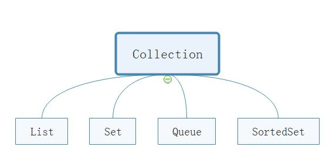

# *Java 类集* #
___
在整个Java类集中最常使用的类集接口是： ***Collection、List、Set、Map、Iterator、ListIterator、Enumeration、SortedSet、SortedMap、Queue、Mao.Entry***   

* **Collection**  是存放一组单值的最大接口，所谓的单值指的是集合中的每个元素都是一个对象。一般很少直接使用此接口直接操作
*  **List** 是 *Collection* 接口的子接口，也是最常用的接口。此接口对 *Collection* 接口进行了大量的扩充。里面的内容都是允许重复的
*  **Set** 是 *Collection* 接口的子类，没有对 *Collection* 接口进行扩充，里面不允许存放重复的内容
*  **Map** 是存放一对值的最大接口，即接口中的每个元素都是一对，以 *key --> value* 的形式保存
*  **Iterator** 集合的输出接口，用于输出集合中的内容，只能进行从前到后的单向输出
*  **ListIterator** 是Iterator的子接口，可以进行双向输出
*  **Enumeration** 是最早的输出接口，用于输出指定集合中的内容
*  **SortedMap** 单值的排序接口，实现此接口的集合类，里面的内容按照 *key* 排序，使用比较器排序
*  **Queue** 对列接口，此接口的子类可以实现队列操作
*  **Map.Entry** 每个 *Map.Entry* 对象都保存着一对 *key --> value* 的内容，每个 *Map* 接口都保存有多个 *Map.Entry* 接口实例

###### *在java中凡是以Sorted开头的全部都属于排序的接口，如SortedSet、SortedMap*

***
***

### *Collection* 接口

	/**
	 * Collection接口的定义
	 * public interface Collection<E> extends Iterable<E>
	 */
	public interface Collection<E> extends Iterable<E>
	
	/**
	 * Collection接口的方法定义
	 */
	public boolean add (E o) //向集合中插入对象
	public boolean addAll (Collection<? extends E> c) //将一个集合的内容插入进来
	public void clear() //清楚此集合中的所有元素

	
### *Map接口的常用子类*

* ***HashMap*** ：无序存放，是新的操作类，key不允许重复
* ***HashTable*** ：无序存放，是旧的操作类，key不允许重复
* ***TreeMap*** ：可以排序的Map集合，按集合中的key排序，key不允许重复
* ***WeakHashMap*** ：弱引用的Map集合，当集合中的某些内容不再使用时清除掉无用的数据，使用gc进行回收
* ***IdentifyHashMap*** ：key可以重复的Map集合

> *HashMap* 采用异步处理方式，性能更高，属于非线程安全的操作类
> *HashTable* 采用同步处理方式，性能较低，属于线程安全的操作类
   
___
       
> ***对象的引用强度***
> 
- 强引用：当内存不足时，JVM宁可出现OOM错误而停止程序，也不会回收对象来释放空间      
- 软引用：当内存不足时，会回收这些对象的内存，用来实现内存敏感的高速缓存
- 弱引用：无论内存是否紧张，被垃圾回收器发现立即回收
- 虚引用：和没有任何引用一样
