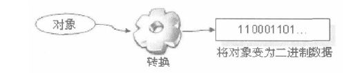
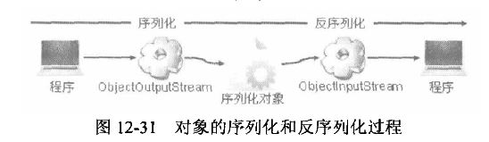

## *对象序列化*

### ***基本概念与Serializable接口***
* 对象序列化 就是把一个对象变成二进制数据流的一种方法，同归对象序列化可以方便的实现对象的传输或存储

>如果一个类的对象要实现序列化，则对象所在的类必须实现 ***java.io.Serializable*** 接口，此接口定义如下：   
	
	public interface Serializable {}
>此接口并没有定义任何方法，所以此接口是一个标识接口。标识一个类具有被序列化的能力。 
	import java.io.Serializable;
	
	/**
	 * Created by jinweih on 2018/8/22.
	 * 定义可以序列化的类
	 * 对象输出流 ObjectOutputStream
	 * 对象输入流 ObjectInputStream
	 * 使用对象输出流输出序列化对象的步骤也成为序列化
	 * 使用对象输入流读入对象的过程也称为反序列化
	 */
	public class SerializableDemo implements Serializable{
	    private String name;
	    private int age;
	    public SerializableDemo (String name, int age) {
	        this.name = name;
	        this.age = age;
	    }
	    public String toString() {
	        return "Name --->> " + name + "Age --->> " + age;
	    }
	}

   
#### ***对象序列化和对象反序列化操作时的版本兼容性问题***
* 在进行对象的序列化操作的，要考虑 ***JDK版本*** 的问题。如果序列化的JDK版本和反序列化的JDK版本不统一则有可能造成异常，所以在序列化的时候引入一个 ***serialVersionUID*** 常量，可以通过此常量来验证版本的一致性。
* 在进行反序列化的时候，JVM会把传来的字节流中的serialVersionUID与本地相应实体类的serialVersionUID进行比较，如果相同就认为是一致的，可以进行反序列化，否则就会出现序列化不一致的异常。   

		private static final long serialVersionUID = 1L;